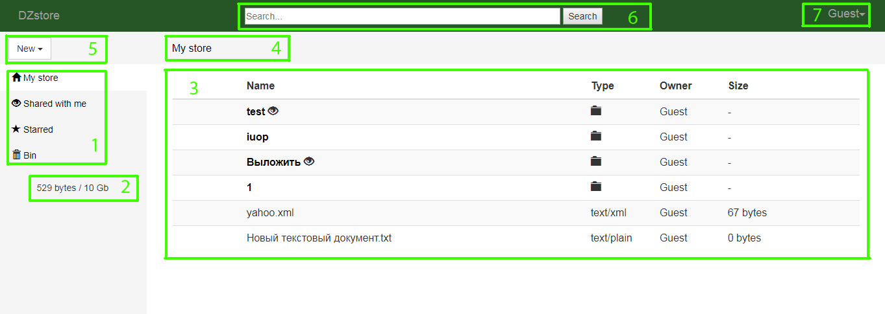
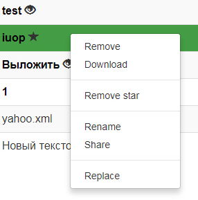

[<h1>DZstore</h1>](http://dzstore.herokuapp.com)

"[DZstore](http://dzstore.herokuapp.com)" is the small online storage that allows to create or upload a structure of folder with files, download it or share them for other users.

**Used Technologies**: Java EE, Maven, Servlets, Spring Framework (IoC, MVC, Security), JPA / Hibernate, MySQL, JSP / JSTL, Bootstrap, CSS, JS.

**Resource limitations**:  Because Heroku allows free of charge to use very limited resources (5 Mb for data base) and don't allows to keep files on hard disk - this storage save all content in data base and allow upload files with size not bigger then 5 Kb.
<h4>Interface of the application:</h4>

1) **Left menu** - include 4 points:
    - **My store** - my files are kept here
    - **Shared with me** - files of other users, which shared for me, are kept here
    - **Starred** - files ,which you marked with star
    - **Bin** - files ,which you remove from your store
2) **Amount of busy memory**   
3) **Space for content** - here you can see all accessible information about your files 
4) **Path to current directory** 
5) **Button for add new content to your store** - here you can create new directory, upload file, upload several files or structure with directories and files
6) **Search of content**
7) **Your account** - here you can see information about your account and exit from it

<h4>Choice of content and operation above him:</h4> 

- **Choice of content** comes true by means of standard combination of left mouse's click and keys of Ctrl and Shift.
- **Operations** above the chosen content are executed by means of context menu (right mouse's click)

<h4>Context menu:</h4> 

  

P.S. On this example not all options are presented - a list depends on the chosen content and from chosen left menu item
- **Remove** - remove chosen content into the Bin.
- **Restore** - returns content from the Bin to store. A point is accessible only for content in a basket 
- **Delete** - deletes content from the Bin (final delete). A point is accessible only for content in a basket
- **Download** - download chosen content from site to your hard disk.
- **Starred** - to mark important for you content.
- **Remove star** - to clean content from select.
- **Rename** - to rename content.
- **Share** - to share chosen content for other(chosen) users. At the choice of addressee for share login or email is specified in a form.(plural choice addressees are specified through a comma) 
- **Replace** - replace choisen content to the chosen folder.
- **Add to my store** - to add other user's files, which are shared for you, into your store.

[_**Dmytro Zhyvodorov**_](https://www.linkedin.com/in/Dmytro Zhyvodorov)
